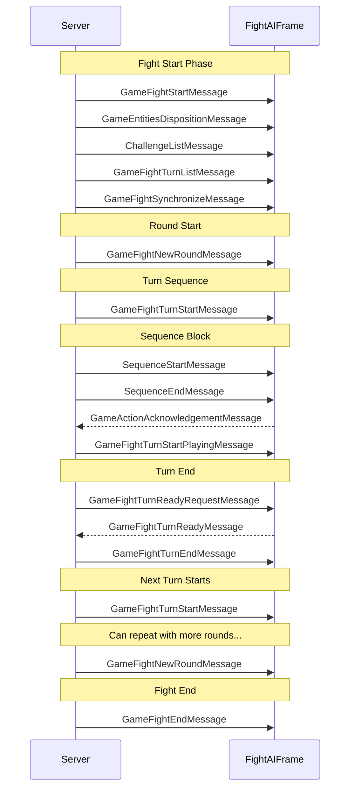

```mermaid
sequenceDiagram
    participant Server
    participant FightAIFrame
    
    Note over Server,FightAIFrame: Fight Start Phase
    Server->>FightAIFrame: GameFightStartMessage
    Server->>FightAIFrame: GameEntitiesDispositionMessage
    Server->>FightAIFrame: ChallengeListMessage
    Server->>FightAIFrame: GameFightTurnListMessage
    Server->>FightAIFrame: GameFightSynchronizeMessage
    
    Note over Server,FightAIFrame: Round Start
    Server->>FightAIFrame: GameFightNewRoundMessage
    
    Note over Server,FightAIFrame: Turn Sequence
    Server->>FightAIFrame: GameFightTurnStartMessage
    
    Note over Server,FightAIFrame: Sequence Block
    Server->>FightAIFrame: SequenceStartMessage
    Server->>FightAIFrame: SequenceEndMessage
    FightAIFrame-->>Server: GameActionAcknowledgementMessage
    
    Server->>FightAIFrame: GameFightTurnStartPlayingMessage
    
    Note over Server,FightAIFrame: Turn End
    Server->>FightAIFrame: GameFightTurnReadyRequestMessage
    FightAIFrame-->>Server: GameFightTurnReadyMessage
    Server->>FightAIFrame: GameFightTurnEndMessage
    
    Note over Server,FightAIFrame: Next Turn Starts
    Server->>FightAIFrame: GameFightTurnStartMessage
    
    Note over Server,FightAIFrame: Can repeat with more rounds...
    Server->>FightAIFrame: GameFightNewRoundMessage
    
    Note over Server,FightAIFrame: Fight End
    Server->>FightAIFrame: GameFightEndMessage
```